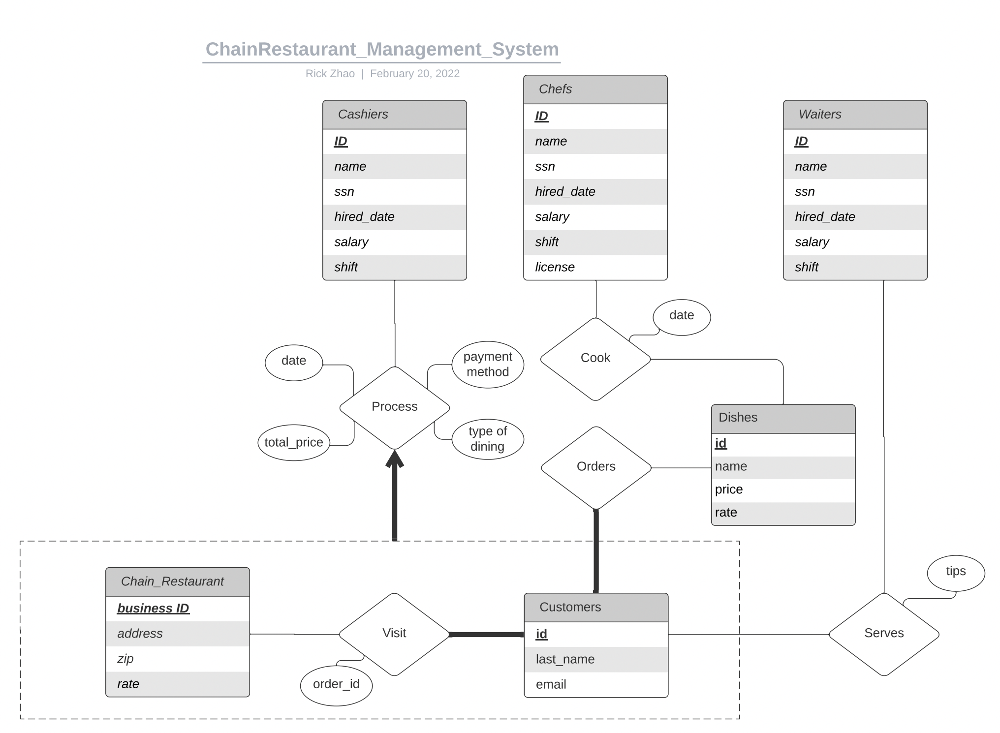

# Chain Restaurants Database Management System

**Web URL:**

+ http://35.211.4.196:8111

**Installation Steps:**

+ 1. Open terminal, run git clone https://github.com/yz4131/Chain-Restaurants-DBMS
+ 2. Install the required lib, including flask, flask_cors, psycopg2, sqlalchemy, nodeJS, npm, react-scripts(npm i react-scripts)
+ 3. Run app.py
+ 4. Run npm start then you're all set

**Contributors:**

+ Yuqin Zhao (yz4131) yz4131@columbia.edu
+ Yutong Chen (yc3993) yc3993@columbia.edu

**PSQL Account:**

+ yc3993

**Description:**

We developed a Web UI for any restaurants to easily manage its Database. 

+ Restaurants Customers: go through Restaurants' Menu, and giving tips to Waiters. 

+ Restaurants Manager: check the information of all Customers and Employees, make adjustments to Employees' information, hire new Employees

Employees are devided into 3 roles: Chefs, Cashiers and Waiters.

+ Chefs: check shift, salary, and record cooking information for food safety purpose.

+ Cashiers: check shift, salary, and check out(recording Customers personal information, payment information, order information)

+ Waiters: check shift, salary and tips they received

**Some Interesting Web Pages**

+ 1. Cashiers' check out page. A Customer tell Cashier his/her names, email address, what he/she would like to order and Cashier selects these items. Then the total amount of money will be shown on the Website. Now, Cashier will continue recording the Restaurant this Customer Visits, the Cashier's own ID, and how this Customer pays for the bills. On the backend, Customer's email and name will be stored in "Customers Table"(if not already exists) and an order ID and a Customer ID will be created for this New Customer. If he/she is an old customer, his/her Customer ID will be searched from the Database and an order ID will be generated. Then, the total amount of money this Customer should pay will be calculated and will pop up on the Website. After this, the Customers' visiting records will be stored in "Visits Table", and the money he/she spends, how he/she pays, and which Cashier checks out for him/her will be put in "Processes Table".

+ 2. Managers' Adjustment page(used by managers to make adjustment to Employees). Manager can simply select the Employee Category(Chefs, Cashiers, Waiters), type in Employee's ID and fill in the information he/she wants to modify. Manager can leave the information he/she does not want to change blank. On the backend, the Manager's input will be checked first. If the Employee ID does not exists, then nothing will be wrote into Database and there will be no response in the front-end, implying that a bad request is made by the Manager. If the Employee ID does exist, then all the empty input will be skipped and information regarding this Employee will be updated to the new value the Manager sets. Then "you are all set" will be poped on the front-end to inform the Manager that change is successfully made.

